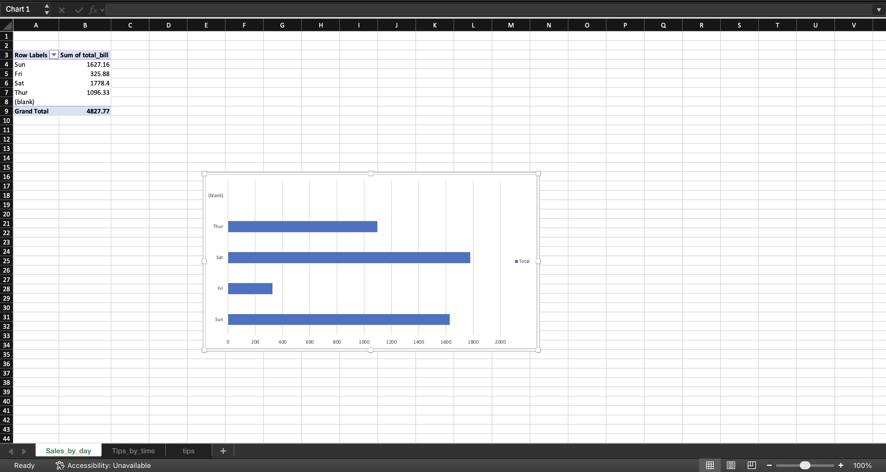
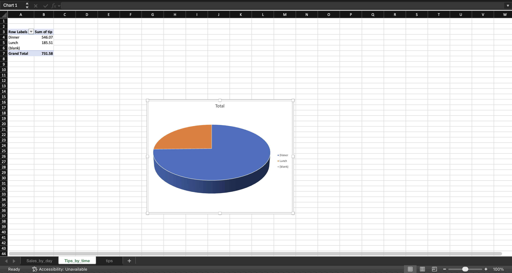

## 📊 Key Insights

- Sales are highest on Saturday and Sunday
- Dinner time generates higher tips compared to lunch
- Weekend sales are higher than weekdays

## 🎯 What I Learned

- Data cleaning and preparation using Excel
- Creating Pivot Tables for analysis
- Identifying trends and patterns in data
- Building charts for visualization
- Understanding business insights from data

## 💡 Why This Project is Useful

- Helps understand customer behavior and sales trends
- Demonstrates data analysis and visualization skills
- Useful for making business decisions
- Strong portfolio project for Data Analyst roles

## 📸 Dashboard

